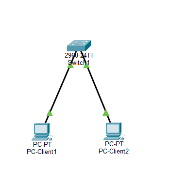
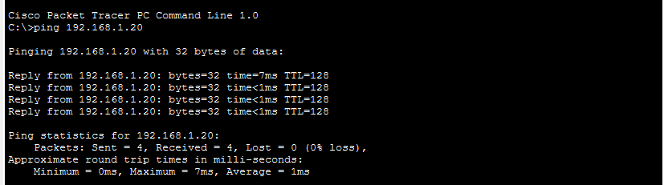

# 🌐 Lab réseau - Segmentation avec VLAN

## 🎯 Objectif
Mettre en place une segmentation réseau à l'aide de VLAN sur un switch afin d'isoler deux machines pourtant connectées au même équipement physique.

---

## 🧱 Topologie réseau

- 2 PC (clients)
- 1 switch

---

## 🌐 Configuration IP

- PC-Client-1 : 192.168.1.10 /24
- PC-Client-2 : 192.168.1.20 /24

---

## ⚙️ Configuration du switch (CLI)

enable  
configure terminal  

vlan 10  
name VLAN10  
exit  

vlan 20  
name VLAN20  
exit  

interface fastethernet 0/1  
switchport mode access  
switchport access vlan 10  
exit  

interface fastethernet 0/2  
switchport mode access  
switchport access vlan 20  
exit  

end  

---

## 🧪 Tests de connectivité

### Avant configuration des VLAN
Les deux machines peuvent communiquer :

---

### Après configuration des VLAN
Les deux machines ne peuvent plus communiquer malgré leur connexion au même switch :

---

## 📈 Résultat

La segmentation réseau via VLAN empêche la communication entre deux machines situées sur le même switch mais appartenant à des VLAN différents.

---

## 🧠 Compétences développées

- Compréhension des VLAN
- Segmentation réseau
- Configuration d’un switch Cisco
- Utilisation du CLI Cisco
- Analyse du comportement réseau

---

## 📁 Fichiers

- lab-vlan-segmentation.pkt
- topologie-vlan-segmentation.png
- test-ping-avant-vlan.png
- test-ping-apres-vlan.png
